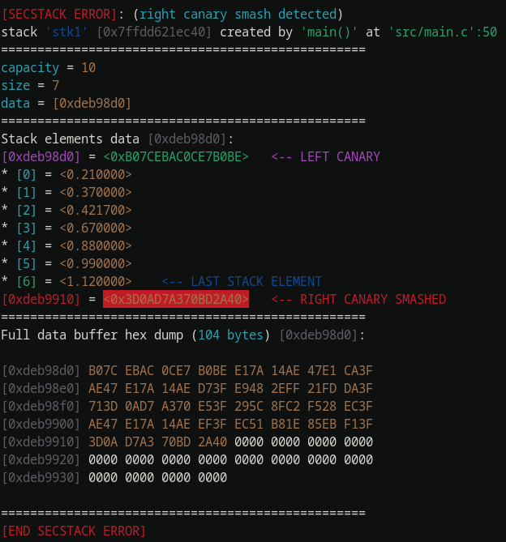

# secstack (secure stack)

## Описание
Данная программа реализует структуру данных стек с канареечной защитой и функциями для отладки.

Библиотека предоставляет тип данных `stack_t` для которого реализованы следующие функции:
* `stack_init`
* `stack_push`
* `stack_pop`
* `stack_verify`
* `stack_destroy`
* `dump_stack_to`

Буффер стека выделяется в куче, его размер автоматически регулируется: если логический размер стека (`size`) достигает размера выделенной под неё памяти (`capacity`), `capacity` вдвоё увеличивается. Если `size` становится меньше или равен четверти `capacity`, `capacity` вдвоё уменьшается.

## Верификация стека
При вызове функции, проверяется:
1. Что указатель на данные стека не `NULL`
2. `size <= capacity`
3. Что указатель на данные стека правильно выравнен
4. Что общий размер стека не больше выделенной под него динамеческой памяти
5. Корректность канареек

Пример вывода дампа стека при порче правой канарейки:

